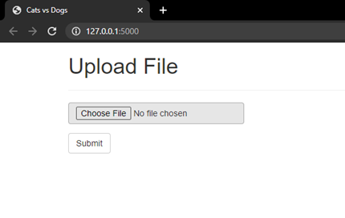
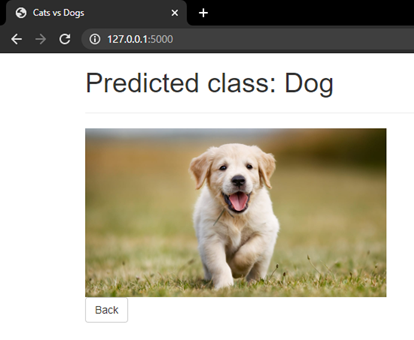
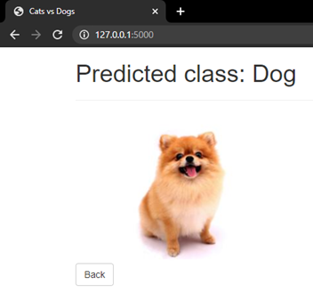
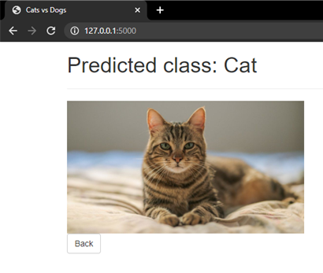

# BinaryClassification-Cats-Dogs-Flask-tflearn
  - This is a very simple project which classifies an image into a dog or a cat. 
  - This project uses tflearn which is the best alternative to Keras.
  - A pre-trained model is also uploaded with an accuracy of 86.2%.
  - Using flask web framework, the images can be uploaded on a web page and the predicted class will displayed according to the predictions.

## Preview
\
\
\
\

## Packages
  - pip install tensorflow==1.15.3
  - pip install tflearn
  - pip install tqdm
  - pip install numpy
  - pip install opencv-python
  - pip install flask
  - pip install flask_bootstrap
  
## Resources
  - The training and testing data can be downloaded from here:
    - https://www.kaggle.com/c/dogs-vs-cats-redux-kernels-edition/data
  - Other resources:
    - https://towardsdatascience.com/a-beginners-guide-to-convolutional-neural-networks-cnns-14649dbddce8
    - https://missinglink.ai/guides/convolutional-neural-networks/fully-connected-layers-convolutional-neural-networks-complete-guide/
    - https://opensource.com/article/18/4/flask
